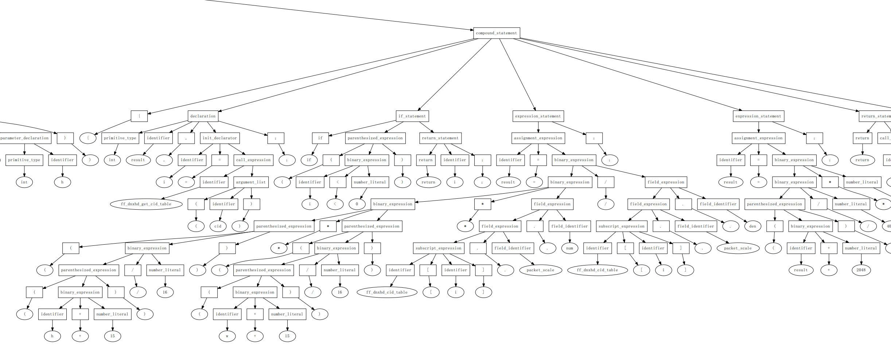
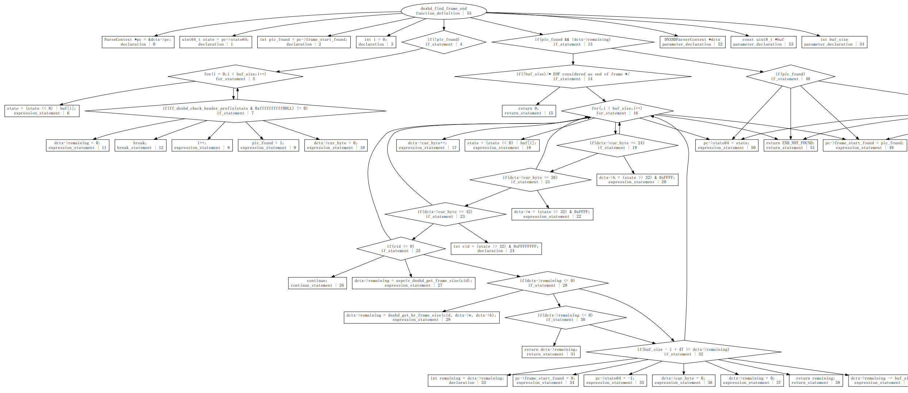
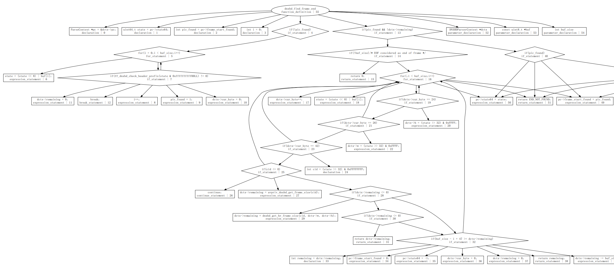
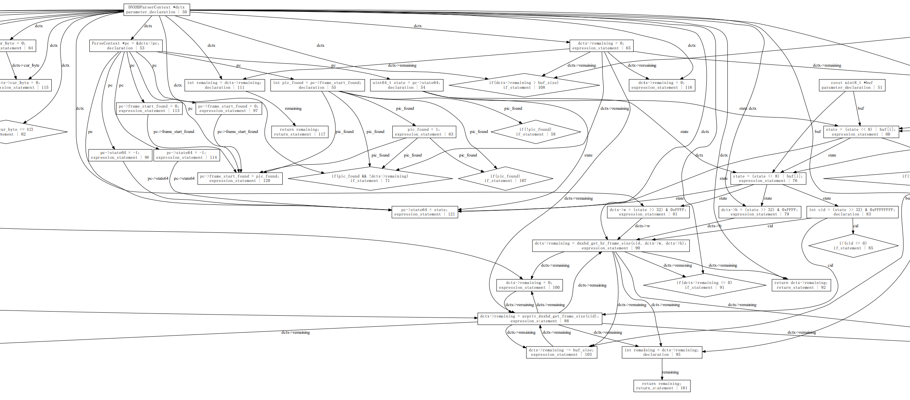
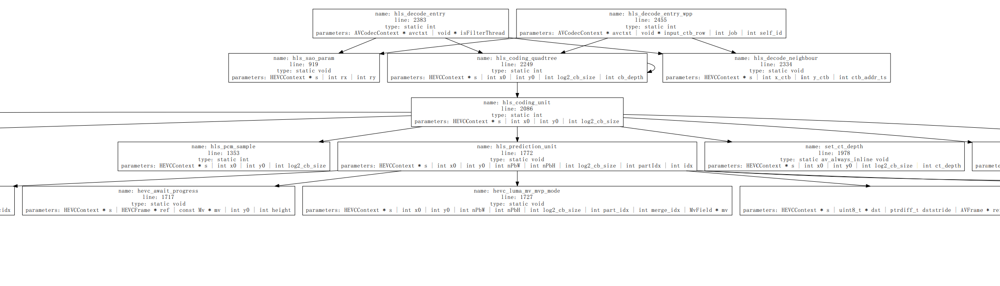
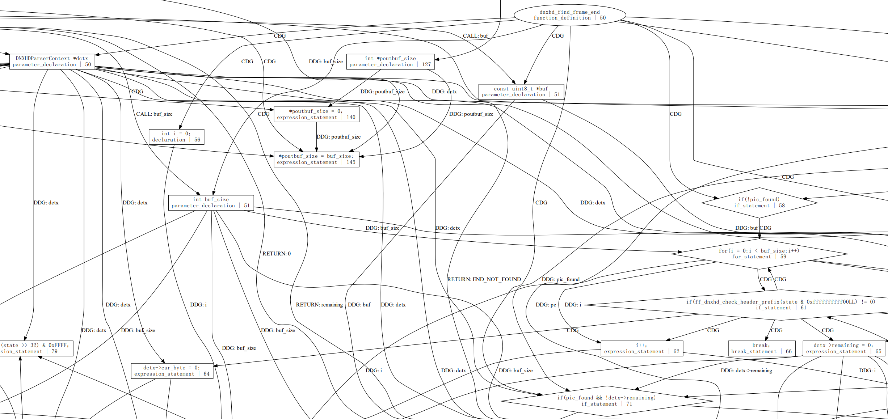

这是一个基于tree-sitter编译工具进行静态程序分析的demo, 工具名为INVEST(statIc aNalysis Via trEe SiTter)，并使用可视化工具graphviz，能够生成抽象语法树AST、控制流图CFG、数据依赖DFG、数据依赖图CDG、程序依赖图PDG、函数调用图CG等。
tree-sitter网址：https://tree-sitter.github.io/tree-sitter/

## 环境配置
确保已经安装了graphviz，在windows上，官网https://www.graphviz.org/ 下载graphviz之后，配置环境变量为安装路径下的bin文件夹，例如D:\graphviz\bin\，注意末尾的'\\'不能省略，如果是linux上，运行下面命令安装：
```
sudo apt-get install graphviz graphviz-doc
```
接着运行
```
pip install -r requirements.txt
```

## 生成AST树
AST.py能够生成AST树以及tokens，首先构造类，参数为代码和对应语言，目前tree-sitter能够编译的语言都能够生成，且能够处理一些错误的语法。
```
ast = AST('c', code)
```
接着运行下面代码可以显示AST树
```
ast.see_graph(code, view=True)
```


可以设置filepath为保存pdf的路径，pdf=True表示调用Digraph库生成pdf文件，view=True时，运行过程中会打开pdf，save=True将AST树使用pickle序列化，由于tree-sitter的Node节点不能被序列化，因此只能将节点信息转成json格式，再保存图，下面的代码用于tokenize整个代码
```
tokens = ast.tokenize(code)
tokens: ['int', 'main', '(', ')', '{', 'int', 'abc', '=', '1', ';', 'int', 'b', '=', '2', ';', 'int', 'c', '=', 'a', '+', 'b', ';', 'while', '(', 'i', '<', '10', ')', '{', 'i', '++', ';', '}', '}']
```

## 生成CFG
CFG.py继承自AST类，能够生成控制流图，运行下面命令可以获得代码的CFG：
```
cfg = CFG('c', code)
cfg.see_graph(view=True)
```
CFG主体函数create_cfg输入根节点和该节点的入边in_nodes，in_nodes为列表，每一个元素为(上一个节点的信息，边的信息)，考虑了if/for/while/do while/switch/goto语句，由于tree-sitter每一次生成AST的节点id是不一样的，为了在后续分析当中保持一致，后面所有的类都不重新生成AST，所用的tree-sitter Node都来自于AST类编译得到的node。
生成的CFG图样例：


## 生成CDG
CDG.py继承自CFG类，能够生成控制依赖图，采用上世纪80年代的古老算法，对CFG先求反向图，加上exit到entry的边，然后求以exit为根节点的任意子树，再根据反向CFG和子树T得到后支配树PDT，最后根据反向CFG和PDT生成支配边界，即CDG，具体算法请参考：https://blog.csdn.net/Dong_HFUT/article/details/121492818?spm=wolai.workspace.0.0.477036c4rNeEPV，运行下面代码能够获得CDG图：
```
cdg = CDG('c', code)
cdg.see_graph(view=True)
```
生成的CDG图样例：


## 生成DDG
DDG.py继承自CFG类，能够生成数据依赖图，在这个代码中，Identifier用于分析一个表达式节点的所有def变量和use变量，例如：
```
assignment
x=y;
def_ids: x
use_ids: y

declaration
int a, b[m], *c, d=x->y;
def_ids: a, b, c, d
use_ids: m, x, x->y

field_expression
a=b->c;
d->e=f;
g->h++;
def_ids: a, d->e, g->h
use_ids: b, b->c, d, f, g, g->h 

array_expression
a = x[m][n];
y[l] = b;
z[i]++;
def_ids: a, y[l], z[i] 
use_ids: x, x[m], x[m][n], b, z[i]
```

运行下面代码能够获得DDG图：
```
ddg = DDG('c', code)
ddg.see_ddg(view=True)
```
生成的DDG图样例：


## 生成CG
CG.py继承自AST.py，能够生成函数调用图，该函数分析了每一个函数的属性，存放在了func_properties里，key是函数名，value保存了函数入口节点id，返回类型，起始行号，形参的节点id和变量，函数调用点和返回点。
- 函数调用点由调用函数名，实参列表和调用点行号组成，实参列表是一个数组，第i个元素表示第i个实参使用到的变量集合。
- 函数返回点由节点id，返回变量名和返回行号组成。

运行下面代码能够生成CG图
```
cg = CG('c', code)
cg.see_graph(view=True)
```
生成CG图样例：




## 生成PDG
PDG.py继承自CFG，先构造CDG和DDG，然后将CDG和DDG的节点和边结合在一起，再生成CG得到函数调用关系，增加call边和return边，其中call边将第i个实参使用到的变量以CALL类型指向函数的第i个形参，每一个return节点返回调用该函数的调用点，运行下面代码获得PDG图：
```
pdg = PDG('c', code)
pdg.construct_pdg()
pdg.interprocedual_analysis(save=False)
pdg.see_graph(view=True)
```
生成的PDG图样例：



## 生成SLICE
目前只做到了输入起始行列表，进行前后向切片以及跨函数切片，运行下面的代码可以生成对应起始行号的切片，最多跨函数层数为3次
```
slice = SLICE('c', code)
slice.get_slice([88, 89, 90, 91, 92], max_cross_time=3)
```